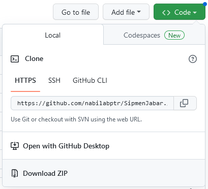
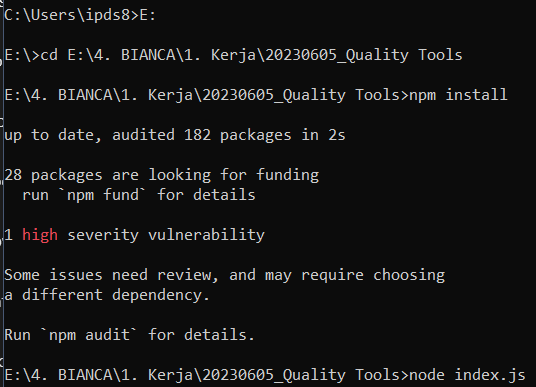

# ADD USER QUALITY TOOLS

**Pastikan sudah install [Node JS](https://nodejs.org/en/download/) di Laptop anda**

1. Klik Download ZIP 


2. Edit file `.env`.
  	- SSO_USERNAME = isikan email
  	- SSO_PASSWORD = isikan password
3. Edit csv yang ada di folder [data](https://github.com/nabilabptr/quality_tools/tree/main/data), tinggal isi tanpa ubah nama kolom. Pastikan nama petugas sesuai dengan database sobat, kalo engga ya error.
	username merupakan username SSO atau username email, contoh: nabila.bianca@bps.go.id atau nabila.bianca@gmail.com maka usernamenya nabila.bianca
5. jalankan scriptnya menggunakan cmd di mana direktorinya adalah folder tempat script js disimpan
	
  install dulu packagenya
  
	```
	npm install
	```
  
  jalanin scriptnya
  
  ```
  node index.js
  ```



**SEMANGAT**
